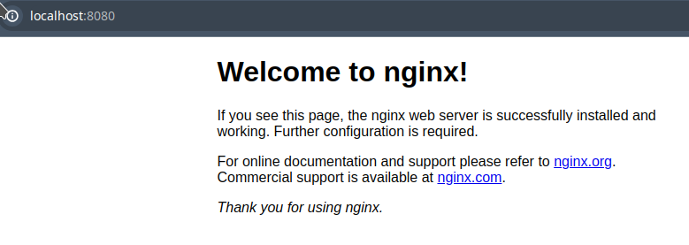

## Part 1. Ready-made docker

- Чтобы установить докер надо использовать следующую каманду 
```bash
sudo apt install docker.io
```
***
- Загрузка образа nginx через команду 
```bash
sudo docker pull nginx
```


***
- Проверка наличия докер образа с помощью команды
```bash
sudo docker images
```


***
- Запуск образа через команду 
```bash
sudo docker run -d [image_id|repository]
```


***
- Проверка наличия процесса, через команду
```bash
sudo docker ps
```


***
- Просмотр информации о контейнере через команду
```bash
sudo docker inspect [container_id|container_name]
```


***
- Размер контейнера можно узнать, через команду
```bash
sudo docker inspect [container_id|container_name] | grep -e Size
```

***
- Замапленные порты можно найти в выводе команды
```bash
sudo docker inspect [container_id|container_name]
```

***
- IP адрес контейнера можно посмотреть командой
```bash
sudo docker inspect [container_id|container_name] | grep -e IPAddress
```

***
- Остановить докер можно командой
```bash
sudo docker stop [container_id|container_name]
```

***
- Проверка остановки образа
```bash
sudo docker ps
```

***
- Запуск докера с портами 80 и 443 в контейнере, замапленными на такие же порты на локальной машине
```bash
sudo docker run -d -p 80:80 -p 443:443 [image_id|repository]
```

***
- Чтобы проверить, что по адресу localhost:80 доступна стартовая страница nginx
```bash
curl localhost:80
```

- А если пробросить порт на 8080 , то можно перейти на такую страницу


***
- Перезапуск докер контейнер через
```bash
sudo docker restart [container_id|container_name]
```


- Проверка наличия процесса


***
## Part 2. Operations with container

- Вывод файла nginx.conf


***
- Создать файл nginx.conf и настроить по пути /status отдачу страницы статуса сервера nginx


***
- Копирование nging.conf внутрь докер образа через 
```bash
docker cp ./nginx.cong [container_id]:etc/nginx/
```

***
- Перезапуск nginx внутри докера
```bash
docker exec [container_id | name] nginx -s reload
```


***
- Проверка, что по адресу localhost:80/status отдается страничка со статусом сервера nginx
```bash
curl localhost:80/status
```


***
- Экспорт докер контейнера в файл
```bash
sudo docker export [container_id | name] > ./container.tar
```


***
- Остановка контейнера
```bash
sudo docker stop [container_id | name]
```


***
- Удали образ, не удаляя перед этим контейнеры
```bash
sudo docker rmi [image_id|repository] -f
```


***
- Удаление остановленного контейнера
```bash
sudo docker rm [container_id | name]
```


***
- Импорт контейнера
```bash
sudo docker import -c 'cmd ["nginx", "-g", "daemon off;"]' -c 'ENTRYPOINT ["/docker-entrypoint.sh"]' ./constainer.tar nginx1
```


***
- Запуск импортированного контейнера


***
- Проверка, что по адресу localhost:80/status отдается страничка со статусом сервера nginx

